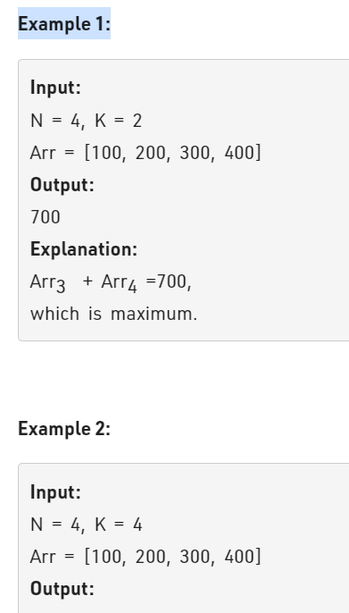

Problem Link : https://practice.geeksforgeeks.org/problems/max-sum-subarray-of-size-k5313/1

Problem Statement : Given an array of integers Arr of size N and a number K. Return the maximum sum of a subarray of size K.

  <br>

 Solution : 

 ```
class Solution{   
public:
    long maximumSumSubarray(int K, vector<int> &Arr , int N){
        // code here 
        long maxSum = accumulate(Arr.begin(), Arr.begin() + K, 0*1ll);
        long windowSum = maxSum;
        for(int i=K;i<N;i++){
            windowSum = windowSum - Arr[i-K] + Arr[i];
            maxSum = max(maxSum, windowSum);
        }
        return maxSum;
    }
};

 ```

 1) TC : O(n)
 2) SC : O(1)